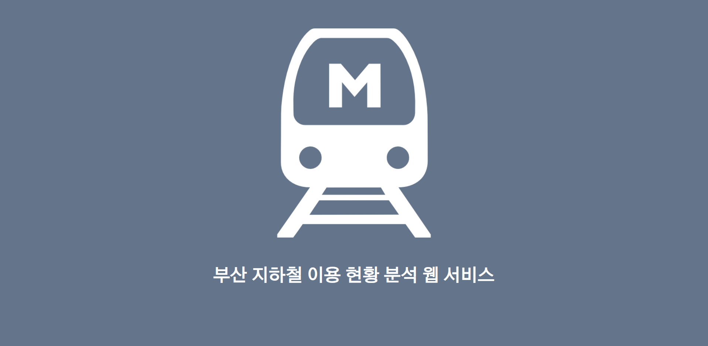
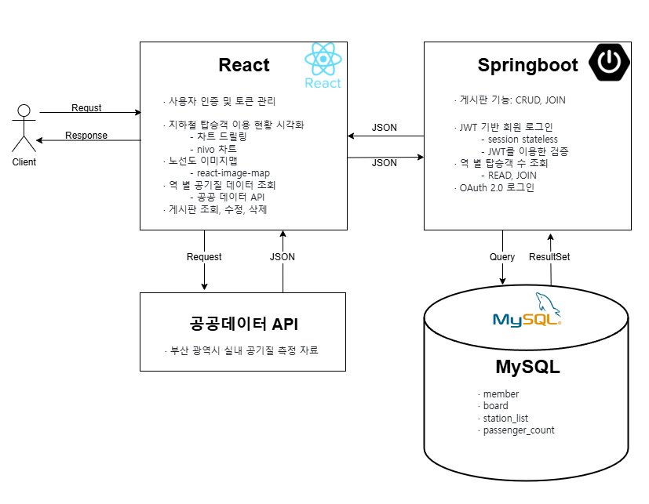
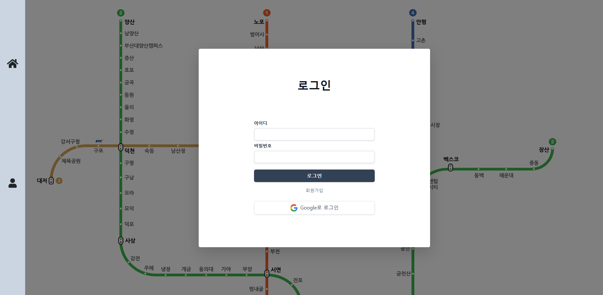
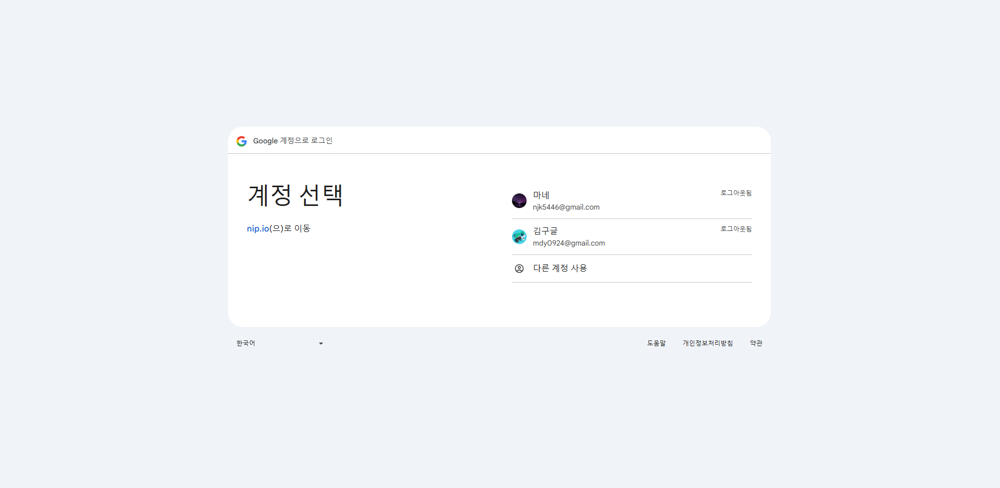
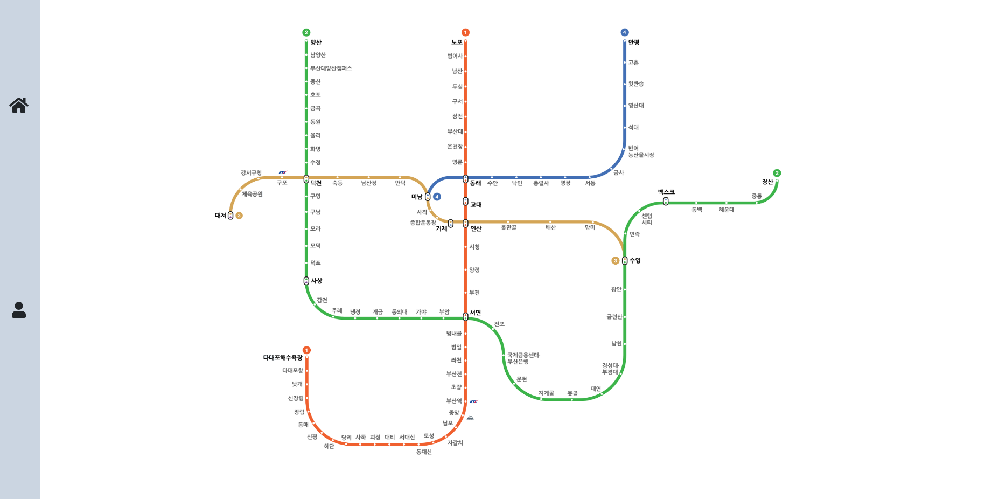
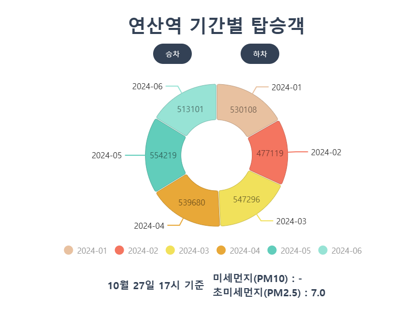
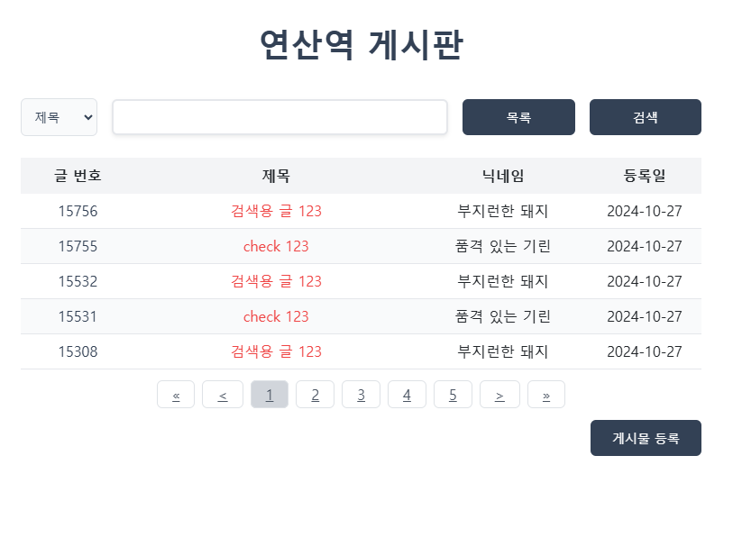
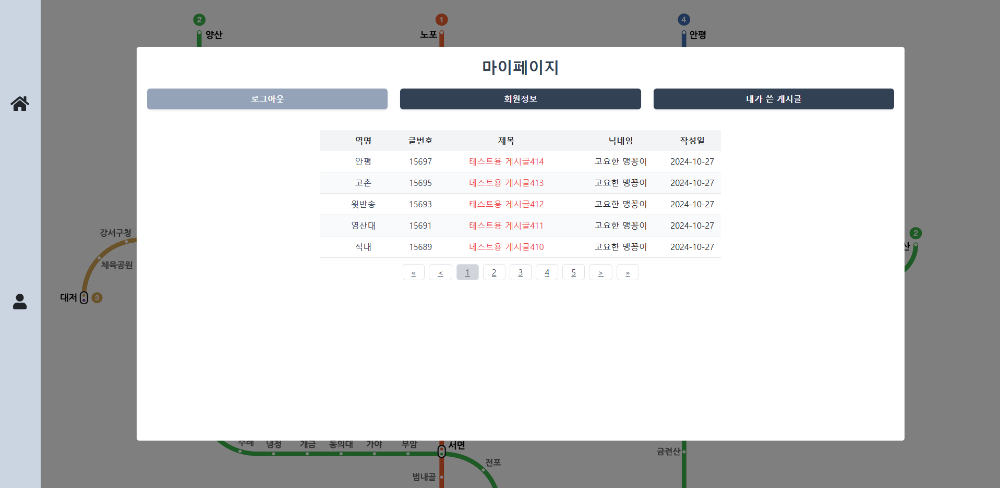

  <h2>부산 지하철 이용 현황 분석 웹서비스 (2024.07.30 ~ 2024.08.23)</h2>
   
  
   
  
   

## 목차
0. **팀원 구성**
1. **웹 서비스 소개**
2. **시스템 아키텍처**
3. **기술 스택**
4. **주요 기능**

 

## 🤝 팀원 구성

- **문동윤**: 프론트엔드 개발
- **김성우**: 백엔드 개발

 

## 💁🏻‍♂ 웹 서비스 소개
- 부산 지하철 승객 이용 현황 시각화
- 지하철 역사 내 실시간 공기질 측정 시각화
- 역 별 회원제 게시판
- SPA 웹 서비스 구현

 

[**🔗 배포된 웹 서비스로 바로가기 Click !**](http://3.36.158.138:4000/) 👈  
<a>(임시 ID: abcd, PW: 11)</a>

> 새 창 열기 방법 : CTRL+click (on Windows and Linux) | CMD+click (on MacOS)

 

## 🏗️ 시스템 아키텍처

 

## 🛠 기술 스택

**Front-end**

-  

**Back-end**

-  
-  
-  

**IDE**
-  
-  

**DevOps / ETC**

-  
-  
- 
-  

 

## 💡 주요 기능
**👉 이미지를 클릭하면 기능 구현 영상을 볼 수 있습니다.**
<table style="width: 100%;">
  <tr>
    <td align="center">
      
       
      <strong style="display: block;">로그인/회원가입</strong>
    </td>
    <td style="vertical-align: top; padding-left: 20px;">
      <ul>
        <li>로그인 시 비밀번호 검증</li>
        <li>로그인, 로그아웃 시 JWT 토큰 생성 또는 제거</li>
        <li>회원가입 시 아이디 중복 확인 랜덤 닉네임 생성, 비밀번호 검증</li>
      </ul>
    </td>
  </tr>
    <tr>
    <td align="center">
      
       
      <strong style="display: block;">Google OAuth 로그인</strong>
    </td>
    <td style="vertical-align: top; padding-left: 20px;">
      <ul>
        <li>Google 로그인 시 임의의 아이디, 닉네임 생성</li>
        <li>최초 로그인 시 비밀번호 변경 필요</li>
      </ul>
    </td>
  </tr>
  <tr>
    <td align="center">
      
       
      <strong style="display: block;">노선도 이미지맵</strong>
    </td>
    <td style="vertical-align: top; padding-left: 20px;">
      <ul>
        <li>역 별 좌표값 지정</li>
        <li>좌표 고정 및 노선도 확대/축소 드래그 기능</li>
      </ul>
    </td>
  </tr>
  <tr>
    <td align="center">
      
       
      <strong style="display: block;">차트/AQI</strong>
    </td>
    <td style="vertical-align: top; padding-left: 20px;">
      <ul>
        <li>차트 드릴링</li>
        <li>기간, 월, 주, 일 단위 탑승객 수 시각화</li>
        <li>역 별 실시간 공기질 데이터 시각화</li>
      </ul>
    </td>
  </tr>
  <tr>
    <td align="center">
      
       
      <strong style="display: block;">게시판</strong>
    </td>
    <td style="vertical-align: top; padding-left: 20px;">
      <ul>
        <li>역 별 게시판</li>
        <li>게시물 검색, 글쓰기, 수정, 삭제</li>
        <li>게시판 페이지네이션</li>
      </ul>
    </td>
  </tr>
  <tr>
    <td align="center">
      
       
      <strong style="display: block;">마이페이지</strong>
    </td>
    <td style="vertical-align: top; padding-left: 20px;">
      <ul>
        <li>마이페이지 접근 시 비밀번호 검증</li>
        <li>비밀번호 및 닉네임 변경(랜덤 닉네임 생성)</li>
        <li>내가 쓴 게시글 조회</li>
        <li>회원탈퇴 기능</li>
      </ul>
    </td>
  </tr>
</table>

 
